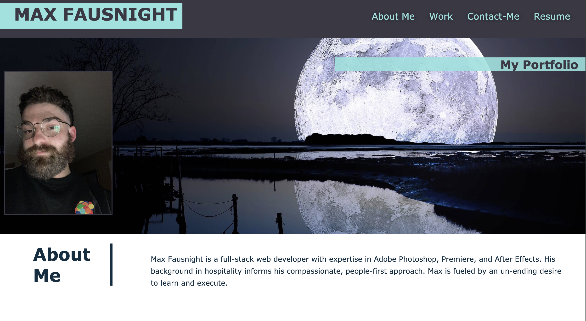
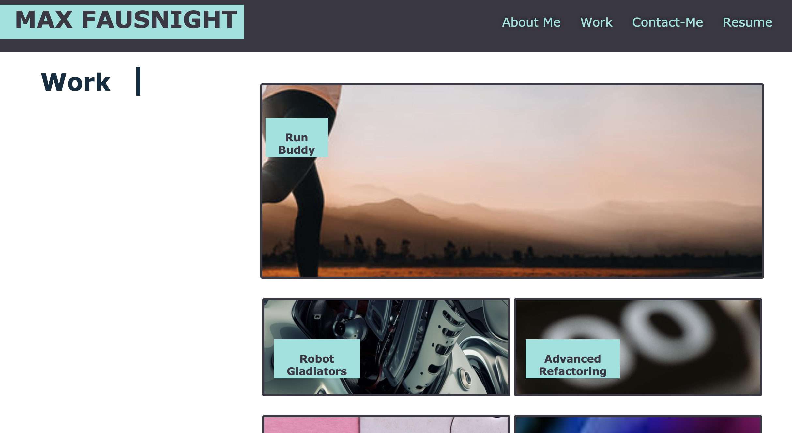
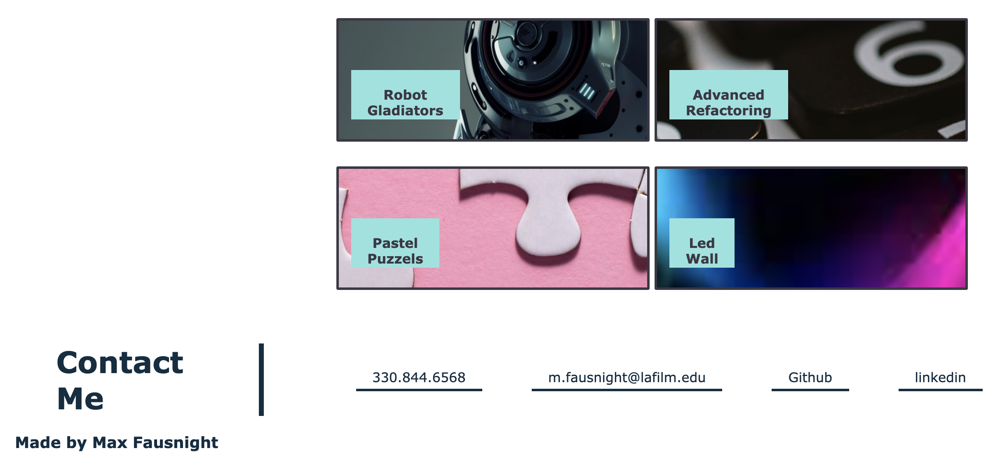

# Portfolio

## Purpose

Here is my portfolio webpage!

I have styled the website using CSS and formatted it to be viewed on multiple screen sizes. The formatting was executed with the flex feature in css. Some unique features like the hover effect have been added where there are live links. The work section gives you the option to follow the link to my deployed applications. Finally, at the bottom, I have linked my contact information.

## Language

HTML
CSS

## Usage

Here is a link to the deployed web-page.

https://fausnightm.github.io/portfolio/

I have also attached screenshots of the webpage.

 

